<div align="center">


<a href="https://git.io/typing-svg">
  
</a>

<br/><br/>


[](https://www.linkedin.com/in/im-ayush-kumar/)
[](mailto:ayushkumarsinghyogesh@gmail.com)
[](https://portfoilo-three-tau.vercel.app/)

</div>

---

## 🧠 About Me

```python
class AyushKumar:
    def __init__(self):
        self.name     = "Ayush Kumar"
        self.role     = ["AI/ML Engineer", "Data Scientist", "Full-Stack Developer"]
        self.location = "India 🇮🇳"
        self.open_to  = ["internships", "full-time roles", "research collaborations"]

        self.ai_stack = {
            "ml_frameworks"  : ["TensorFlow", "scikit-learn", "Pandas", "NumPy"],
            "computer_vision": ["OpenCV"],
            "languages"      : ["Python", "C", "C++"],
        }

        self.web_stack = {
            "frontend" : ["React", "Angular", "HTML5", "CSS3", "Bootstrap", "JavaScript"],
            "backend"  : ["Ruby on Rails", "Node.js", "Express", "Django"],
            "databases": ["MongoDB", "MySQL", "PostgreSQL", "Oracle"],
            "cloud"    : ["AWS", "Git"],
        }

        self.mobile_and_other = {
            "mobile"   : ["Flutter", "Android", "Swift"],
            "systems"  : ["Arduino", "Unity3D", "C++", "Photoshop"],
        }

        self.currently_learning = [
            "LLMs & RAG pipelines",
            "MLOps",
            "Advanced CV architectures",
            "Advanced Rails patterns & API design",
        ]
        self.fun_fact = "I prototype ideas from research papers just to see if they work 📄"

    def approach(self):
        return "Ruby to React to Robots. Breadth of stack. Depth of thought."
```

---

## 🔬 Current Focus Areas
<div align="center">
  | Domain | What I work with |
  |--------|-----------------|
  | 🤖 **AI / Machine Learning** | TensorFlow, OpenCV, scikit-learn, Pandas, NumPy, Python |
  | 🌐 **Full-Stack Web** | React, Angular, Ruby on Rails, Node.js, Django, Express |
  | 🗄️ **Databases & Cloud** | MongoDB, MySQL, PostgreSQL, Oracle, AWS |
  | 📱 **Mobile Development** | Flutter (cross-platform), Android (native) |
  | ⚙️ **Systems & Hardware** | Arduino, C/C++, Unity3D (ML-Agents), IoT |
  | 🔭 **Currently Exploring** | LLMs, RAG, MLOps, Advanced CV, Rails API patterns |
</div>
---

## 🛠️ My Tech Stack

<div align="center">
  
</div>

---

## 📊 GitHub Stats

> *Focused on building — quality over quantity.*

<div align="center">


</div>

---

## 📡 Activity

<div align="center">


<div align="center">

</div>

---

## 🎯 What I'm Up To

- 🔭 Building at the intersection of **AI + full-stack web (Rails + React)**
- 🌱 Learning **LLM fine-tuning, RAG systems, and MLOps pipelines**
- 💎 Deepening **Ruby on Rails** — API design, ActiveRecord, background jobs
- 📱 Exploring advanced **Flutter** and **native Android** patterns
- 🔧 Experimenting with **Arduino IoT** and cloud sensor pipelines
- 💬 Ask me about **React, Ruby on Rails, Node.js, TensorFlow, Flutter, or system design**
- 📫 Reach me: **ayushkumarsinghyogesh@gmail.com**
- ⚡ Fun fact: I build across 5+ domains — web, mobile, AI, hardware, and game dev

---

## 🌐 Connect With Me

<div align="center">

[](https://www.linkedin.com/in/im-ayush-kumar/)
[](https://portfoilo-three-tau.vercel.app/)
[](mailto:ayushkumarsinghyogesh@gmail.com)

</div>

---

<div align="center">

<sub>
  <b>Ruby to React to Robots. Breadth of stack. Depth of thought.</b><br/>
  Built with curiosity — from machine learning to mobile to microcontrollers.
</sub>
</div>
